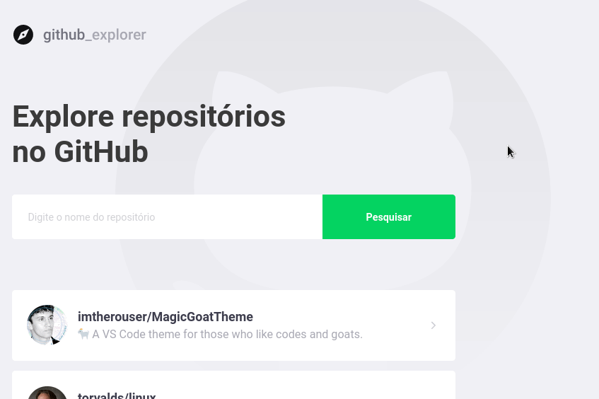
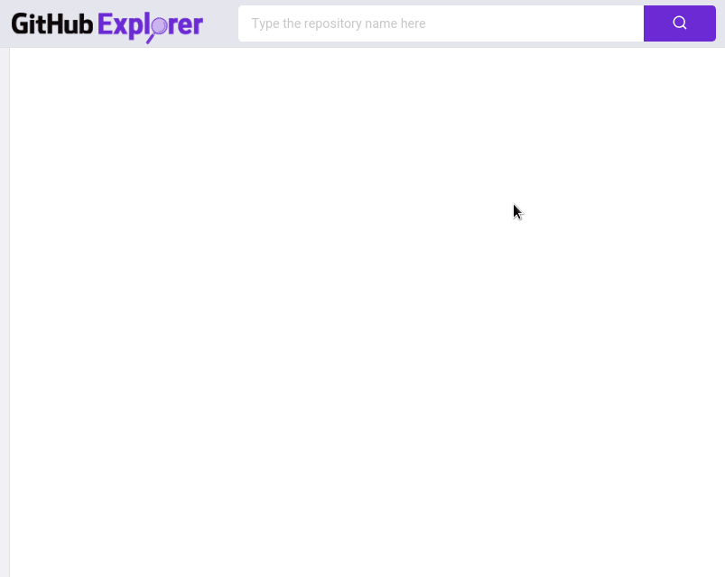

  

### 🐙 GitHub Explorer

> **English:** An app to explore GitHub repositories.

> **Português:** Um app para explorar repositórios no GitHub.

### 🐙 Result of my code following the original idea:

  

### 🐙 My version of the app idea in a "file manager" style:

  

[⇦ Back to the main page](https://github.com/imtherouser/MyRocketseatCodes#🚀)
