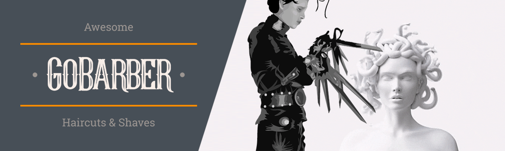
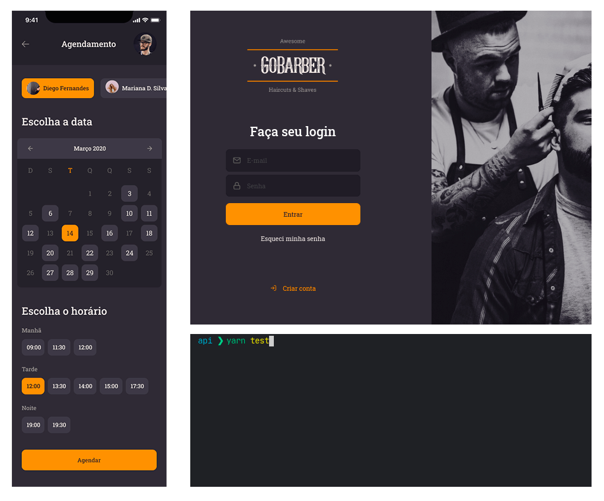

  

### 🎓 GoBarber

> **English:** In this class we develop a complete solution (backend, web and mobile) for barbershop, using different technologies, design patterns and concepts. Check out some tools used below.

> **Português:** Nesta aula desenvolvemos uma solução completa (backend, web e mobile) para barbearia, utilizando diversas tecnologias, padrões de design e conceitos. Confira algumas ferramentas usadas abaixo.

### 🎓 Some of the technologies used

<table>
<tbody>
  <tr>
    <td>Eslint</td>
    <td>NodeJS</td>
    <td>ReactJS</td>
    <td>React Native</td>
    <td>Express</td>
  </tr>
  <tr>
    <td>Babel</td>
    <td>TypeScript</td>
    <td>Knex</td>
    <td>CORS</td>
    <td>Axios</td>
  </tr>
  <tr>
    <td>Postgre</td>
    <td>MongoDB</td>
    <td>Redis</td>
    <td>TypeORM</td>
    <td>TSyringe</td>
  </tr>
  <tr>
    <td>Multer</td>
    <td>Nodemailer</td>
    <td>AWS SDK</td>
    <td>Styled Components</td>
    <td>Handlebars</td>
  </tr>
  <tr>
    <td>Celebrate</td>
    <td>Yup</td>
    <td>Unform</td>
    <td>Jest</td>
    <td>Prettier</td>
  </tr>
  <tr>
    <td>ioredis</td>
    <td>BcryptJS</td>
    <td>date-fns</td>
    <td>JsonWebToken</td>
    <td>Docker</td>
  </tr>
</tbody>
</table>

### 🎓 Original GoBarber:

  

  

### 🎓 My alien Figma design:

> Original design on Figma : **[click here](https://www.figma.com/file/BXCihtXXh9p37lGsENV614/GoBarber?node-id=34%3A1181)**

> My alien design on Figma: **[click here](https://www.figma.com/file/reEYELjIUyYEsigChzLPJw/Alien-GoBarber?node-id=0%3A1)**

  

  

[⇦ Back to the main page](https://github.com/BON4S/MyRocketseatCodes#🚀)
