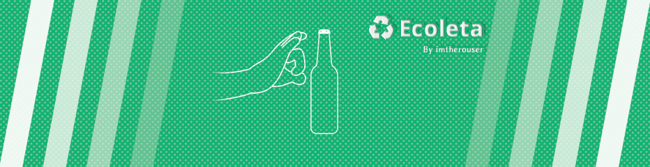

  

### 🟢 Ecoleta

> **English:** Ecoleta is an application to map and locate companies that collect waste in a sustainable way.

> **Português:** Ecoleta é um aplicativo para mapear e localizar empresas que coletam resíduos de maneira sustentável.

- **Event:** Next Level Week

- **Edition:** 1

- **Date:** 2020.06.01 - 2020.06.07

### 🟢 Result of my code following the original idea:

  

### 🟢 My implementation of a web user interface:

  

[⇦ Back to the main page](https://github.com/BON4S/MyRocketseatCodes#🚀)
