

  

  
  

  <a aria-label="__dotted_line__" href="https://github.com/BON4S/MyRocketseatCodes#🚀">
    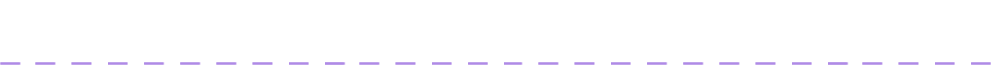
  </a>

### 🟪 **Bootcamp Codes - GoStack 11**

> GoStack 11 was intensive training in technologies like NodeJS, ReactJS, React Native and many others.

✅ **[GitHub Explorer](bootcamp/GoStack11/GitHubExplorer#🚀)** ➜ An app to explore GitHub repositories (developed at the beginning of the bootcamp to introduce about api).

<table>
  <tr>
    <td>
      <a href="bootcamp/GoStack11/GitHubExplorer#🚀">
        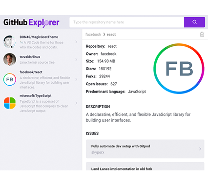
      </a>
    </td>
    <td>
      <a href="bootcamp/GoStack11/GitHubExplorer#🚀">
        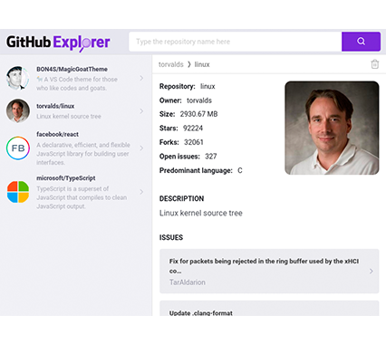
      </a>
    </td>
    <td>
      <a href="bootcamp/GoStack11/GitHubExplorer#🚀">
        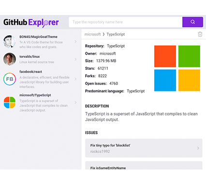
      </a>
    </td>
    <td>
      <a href="bootcamp/GoStack11/GitHubExplorer#🚀">
        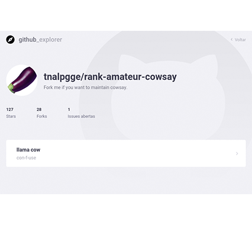
      </a>
    </td>
  </tr>
</table>

✅ **[GoBarber](bootcamp/GoStack11/GoBarber#🚀)** ➜ A complete solution (api, web and mobile) for barbershop. 🌟 Highlighted Code! 🌟

<table>
  <tr>
    <td>
      
    </td>
    <td>
      
    </td>
    <td>
      <a href="bootcamp/GoStack11/GoBarber#🚀">
        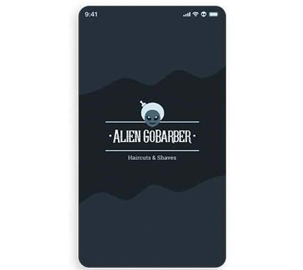
      </a>
    </td>
    <td>
      <a href="bootcamp/GoStack11/GoBarber#🚀">
        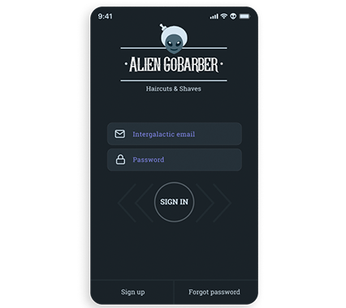
      </a>
    </td>
  </tr>
</table>

  

### 🟪 **YouTube/Twitch Codes**

> Content learned on the Rocketseat channel on YouTube or Twitch.

✅ **[LinkedIn Clone](youtube/LinkedInClone#🚀)** ➜ It is a clone of the LinkedIn user interface in order to learn how to apply the "Shimmer Effect".

<table>
  <tr>
    <td>
      <a href="youtube/LinkedInClone#🚀">
        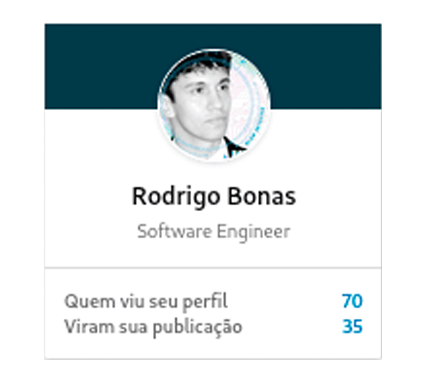
      </a>
    </td>
    <td>
      <a href="youtube/LinkedInClone#🚀">
        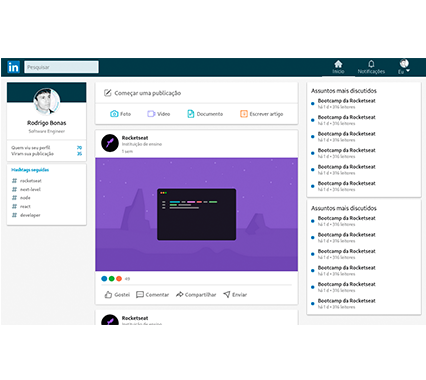
      </a>
    </td>
    <td>
      
    </td>
    <td>
      <a href="youtube/LinkedInClone#🚀">
        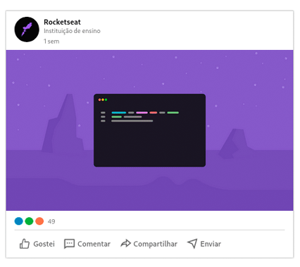
      </a>
    </td>
  </tr>
</table>

  

### 🟪 **Next Level Week Codes**

> Periodic event where we develop complete solutions - api, web and mobile.

✅ **[Ecoleta](events/NextLevelWeek/NLW01-Ecoleta#🚀)** _(NLW 01)_ ➜ Ecoleta is an application to map and locate companies that collect waste in a sustainable way.

<table>
  <tr>
    <td>
      <a href="events/NextLevelWeek/NLW01-Ecoleta#🚀">
        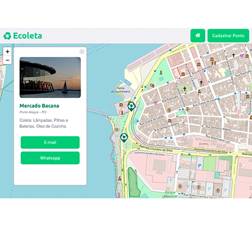
      </a>
    </td>
    <td>
      <a href="events/NextLevelWeek/NLW01-Ecoleta#🚀">
        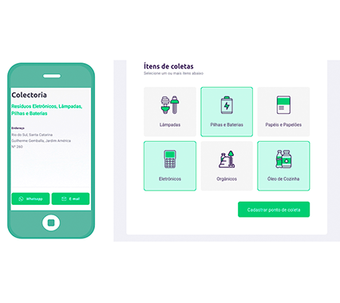
      </a>
    </td>
    <td>
      <a href="events/NextLevelWeek/NLW01-Ecoleta#🚀">
        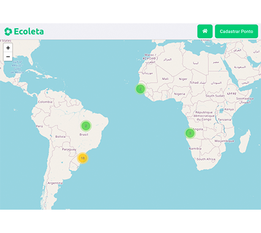
      </a>
    </td>
    <td>
      <a href="events/NextLevelWeek/NLW01-Ecoleta#🚀">
        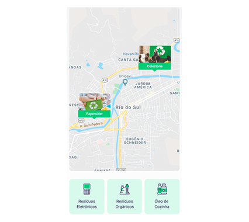
      </a>
    </td>
  </tr>
</table>

  

### 🟪 **Semana OmniStack Codes**

> Event, that no longer exists, where we developed complete solutions - api, web and mobile.

✅ **[Be The Hero](events/SemanaOmniStack/SO11-BeTheHero#🚀)** _(SO 11)_ ➜ We developed an application to connect NGOs to people willing to help.

<table>
  <tr>
    <td>
      <a href="events/SemanaOmniStack/SO11-BeTheHero#🚀">
        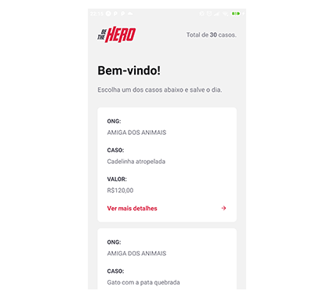
      </a>
    </td>
    <td>
      <a href="events/SemanaOmniStack/SO11-BeTheHero#🚀">
        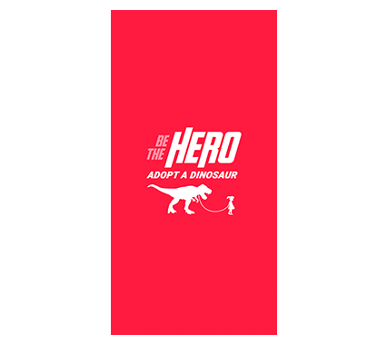
      </a>
    </td>
    <td>
      
    </td>
    <td>
      <a href="events/SemanaOmniStack/SO11-BeTheHero#🚀">
        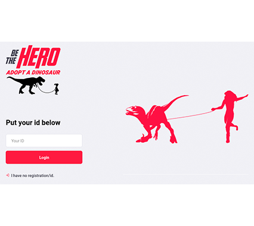
      </a>
    </td>
  </tr>
</table>

  

### 🟪 Useful Links

↳ [Rocketseat - Me on Rocketseat's social network](https://app.rocketseat.com.br/me/bonas#🚀)

↳ [Rocketseat - Main page](https://rocketseat.com.br/#🚀)

↳ [Rocketseat - YouTube](https://www.youtube.com/rocketseat#🚀)

↳ [Rocketseat - Twitch](https://www.twitch.tv/rocketseat_oficial#🚀)

↳ [Rocketseat - Twitter](https://twitter.com/rocketseat#🚀)

↳ [Rocketseat - GitHub](https://github.com/Rocketseat#🚀)

↳ [Rocketseat - Facebook](https://www.facebook.com/rocketseat#🚀)
