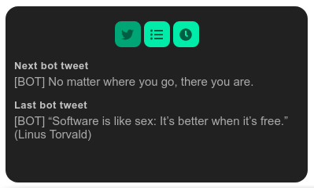

<p align="center">
  <a href="https://github.com/ronoctua/DumbBot">
    
  </a>
</p>

# DBM-AutoTweet

🔹 **What is DBM-AutoTweet?**

DBM-AutoTweet is a module for DumbBot. `DBM` means: _<ins>D</ins>umb<ins>B</ins>ot <ins>M</ins>odule_.

With this module you can schedule posts (Tweets) to Twitter.

🔹 **What is DumbBot?**

[DumbBot](https://https://github.com/ronoctua/DumbBot) is a modular program that runs apps in the system tray. With which you can easily create and run React apps in a component/module format.

🔹 **How to install DBM-AutoTweet?**

To install this module _(**1.**)_ run DumbBot, _(**2.**)_ choose the `Add Module` option, and then _(**3.**)_ paste the url of this repository.

You also need to install MongoDB on your computer. For this you can use Docker:

```bash
# 1.
docker pull mongo

# 2.
docker run -d -p 27017-27019:27017-27019 --name mongodb mongo
```

🔹 **How to configure DBM-AutoTweet?**

After installing, create your [Twitter Dev Account](https://developer.twitter.com/en), and place your api codes on `configurations.mjs` file and set the 'startDbAndServer' to 'true', as below:

```JavaScript
export const preferences = {
  startDbCommand: 'docker start mongodb',
  startDbAndServer: true,
};

export const modules = [
  {
    name: 'DBM-AutoTweet',
    configs: {
      tweetPostingSchedule: 'daily', // 'daily' or 'weekly'
      apiKey: 'XXXXXXXXXXXXXXXXXXXXXXXXXXXXXXXXXX',
      apiSecretKey: 'XXXXXXXXXXXXXXXXXXXXXXXXXXXX',
      accessToken: 'XXXXXXXXXXXXXXXXXXXXXXXXXXXXX',
      accessTokenSecret: 'XXXXXXXXXXXXXXXXXXXXXXX',
    },
    container: 'middle-center',
  },
]
```
