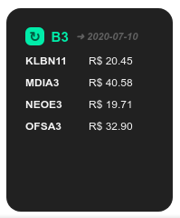

<p align="center">
  <a href="https://github.com/ronoctua/DumbBot">
    
  </a>
</p>

# DBM-B3

🔹 **What is DBM-B3?**

DBM-B3 is a module for DumbBot. `DBM` means: _<ins>D</ins>umb<ins>B</ins>ot <ins>M</ins>odule_.

This is a module to monitor the B3 (Bovespa) - Brazilian stock exchange.

🔹 **What is DumbBot?**

[DumbBot](https://https://github.com/ronoctua/DumbBot) is a modular program that runs apps in the system tray. With which you can easily create and run React apps in a component/module format.

🔹 **How to install DBM-B3?**

To install this module is very easy. Just _(**1.**)_ run DumbBot, _(**2.**)_ choose the `Add Module` option, and then _(**3.**)_ paste the url of this repository.

🔹 **How to configure DBM-B3?**

After installing, edit your `configurations.mjs` file.

Write your stock codes there as in the example below:

```JavaScript
export const modules = [
  {
  name: 'DBM-B3',
  configs: {
    targets: ['KLBN11', 'MDIA3'],
  },
  container: 'middle-center',
  },
]
```
