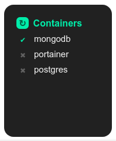

  

# DBM-Docker

🔹 **What is DBM-Docker?**

DBM-Docker is a module for DumbBot. `DBM` means: _<ins>D</ins>umb<ins>B</ins>ot <ins>M</ins>odule_.

This module shows your Docker containers. With this module you can activate or deactivate them.

🔹 **What is DumbBot?**

[DumbBot](https://https://github.com/ronoctua/DumbBot) is a modular program that runs apps in the system tray. With which you can easily create and run React apps in a component/module format.

🔹 **How to install DBM-Docker?**

To install this module is very easy. Just _(**1.**)_ run DumbBot, _(**2.**)_ choose the `Add Module` option, and then _(**3.**)_ paste the url of this repository.

🔹 **How to configure DBM-Docker?**

This module does not need to be configured.
