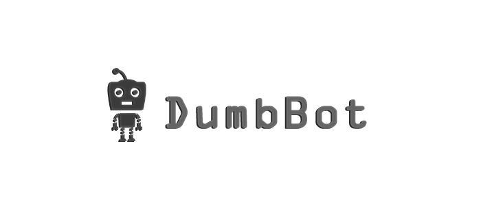
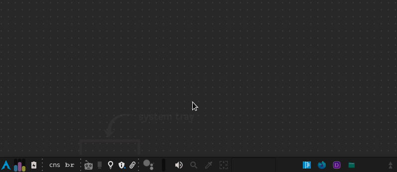
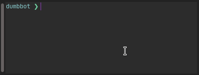

<p align="center">
  <a href="https://github.com/Studies/Others/DumbBot">
    
  </a>
</p>

<p align="center">
  <a href="https://github.com/Studies/Others/DumbBot">
    
  </a>
</p>

<br />

[◄ Back link](https://github.com/imtherouser/Studies#🖖)

## 🔹 What is DumbBot?

**DumbBot is a program that runs React apps on the system tray.**

I created this app just to learn more about **NW.js**.

It is easy to create React apps/modules for DumbBot, and to install the apps it is also easy, **just copy and paste the link from the app's GitHub repository into DumbBot**.

About the name: _"BOT, is a software application that performs automated tasks..."_ (Wikipedia). DumbBot is a bot designed to do tasks automatically, but it is dumb, because by default the application does nothing, you need to install some app/module for it to do something.

---

> **CLICK BELOW TO EXPAND**

<details>

<summary>How to install and run DumbBot?</summary>

## 🔹 How to install and run DumbBot?

It is necessary to have **Yarn** (necessary for workspaces) and NodeJS installed on the computer (modules may have other requirements).

To install run:

```bash
cd app && yarn && cd .. && node dumbbot.mjs
```

The **configurations.mjs** file will appear in the root folder. In this file you can change the colors and settings of the DumbBot.

Once installed, the next times just run:

```bash
node dumbbot.mjs
```

---

</details>

<details>

<summary>Modules</summary>

## 🔹 Modules

<table>
 <tr>
  <th>
    Module name
  </th>
  <th>
    Description
  </th>
 </tr>
 <tr>
  <td>
    DBM-Image
  </td>
  <td>
    It is just an example module that shows an image rotating.
  </td>
 </tr>
  <tr>
  <td>
    DBM-Docker
  </td>
  <td>
    This module shows the Docker containers present on computer.
  </td>
 </tr>
  <tr>
  <td>
    DBM-AutoTweet
  </td>
  <td>
    It is a module for scheduling Twitter posts.
  </td>
 </tr>
  <tr>
  <td>
    DBM-B3
  </td>
  <td>
    This is a module to monitor the B3 (Bovespa) - Brazilian stock exchange.
  </td>
 </tr>
</table>

---

</details>

<details>

<summary>How install a module?</summary>

## 🔹 How to install a module?

**1.** Run DumbBot and choose the option 'Add module';

**2.** Paste the GitHub URL of the module.

That's it.

<p align="center">
  <a href="https://github.com/Studies/Others/DumbBot">
    
  </a>
</p>

Some modules can be more complicated and require the installation of something else. But on the module pages you have an explanation of how to do the installation.

---

</details>

<details>

<summary>How create a module?</summary>

## 🔹 How to create a module?

**1.** Run DumbBot and choose the option 'Create module';

**2.** And then, write the module name.

Your module will be created in the folder: app/src/modules/DBM-YourModule

Then just modify the code.

To install any dependency on your module, run:

```bash
yarn --cwd app/src/modules/DMB-YourModule add DEPENDENCY_NAME
```

DumbBot comes with some global dependencies that do not require installation to be used (see package.json) such as: styled-components, polished, react-icons and axios.

**EXTRA**

DumbBot comes with database support. To activate it you must have MongoDB installed on your computer (I suggest creating a simple installation with Docker), and the configuration.mjs file must have <ins>'startDbAndServer'</ins> set to <ins>'true'</ins>:

```js
startDbAndServer: true,
```

You can interact on routes with Axios. As in the example below:

```js
const yourData = {
  name: "YourModuleName",
  text: "Hello Word!",
};

axios({
  url: "http://localhost:3003/db/add",
  method: "POST",
  data: yourData,
})
  .then(() => {
    // Do something.
  })
  .catch((err) => {
    console.error(err);
  });
```

See all routes in the file: app/src/server-db-test/universalController.js

And the model in the file: app/src/server-db-test/Universal.js

</details>

---

[◄ Back link](https://github.com/imtherouser/Studies#🖖)
