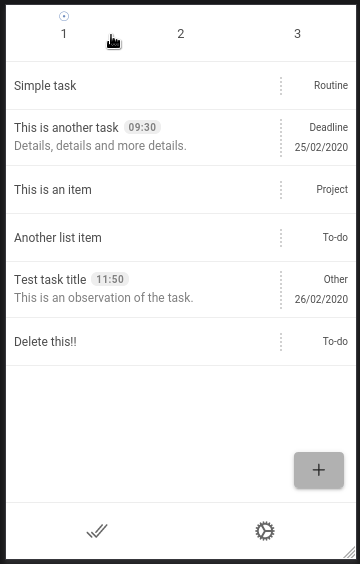
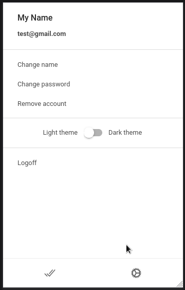

| Login page                                        | Lists                                             | Settings                                                |
| ------------------------------------------------- | ------------------------------------------------- | ------------------------------------------------------- |
|  |  |  |

<br />

[◄ Back link](https://github.com/imtherouser/Studies#🖖)

# Ionic List App

It's a simple to-do list app.

This is an old app code that I created with the little help of some random tutorial video on YouTube, **it’s the first app I’ve ever created**. I created this to learn about Ionic (with Angular and Capacitor).

---

> **CLICK BELLOW TO EXPAND**

<details>

<summary>Installation/configuration</summary>

## Installation/configuration

Let's install the app and create a free database.

**Step 1.**

Make sure you have Node, Ionic and Android Studio installed. And make sure you have the code of the app in a folder on your computer.

**Step 2.**

Go to the Google [Firebase](https://console.firebase.google.com/).

- Create a project with the name "**listapp**";

- On the project's homepage, click on the "**</>**" icon to create the web code for your project. Then a field will appear to enter the name of the app. Type "**listapp**" and click to register. Then a code will appear on the screen.

- Just copy the code that is inside the variable, and then, go to the "/src/environments" app folder and there create two files with the names "**environment.ts**" and "**environment.prod.ts**". In both files place the same code below, just replacing the data copied in Firebase. And for the "environment.prod.ts" file, also change the "_production_" to "**true**".

_environment.ts:_

```typescript
export const environment = {
  production: false,
  firebase: {
    apiKey: "xxxxxxxxxxxxxxxxxxxxxxxxxxxxxxxxxxxxxxxxxxxxx",
    authDomain: "listapp-xxxx.firebaseapp.com",
    databaseURL: "https://listapp-xxxx.firebaseio.com",
    projectId: "listapp-xxxx",
    storageBucket: "listapp-xxxx.appspot.com",
    messagingSenderId: "xxxxxxxxxxxxx",
    appId: "x:xxxxxxxxxxxx:web:xxxxxxxxxxxxxxxxxxxxxxx",
  },
};
```

**Step 3.**

Back in Firebase, click on "Authentication" and activate the login method: "**Email/password**".

Firebase EXTRA 1: If you want, in this section it is possible to modify the default confirmation email, just click on the "Models" tab.

Firebase EXTRA 2: And to change the public name of the app click on the gear icon (Settings) in the side menu. There you can change.

**Step 4.**

In Firebase, click on "Database" and **create a new database**. After creating it, click on the "Rules" tab, delete the code shown and write the following:

```text
rules_version = '2';
service cloud.firestore {
  match /databases/{database}/documents {
    match /users/{userID}/{document=**} {
      allow read, write: if request.auth.uid == userID;
    }
  }
}
```

**Step 5.**

In the app folder, run in the terminal the following command:

```bash
npm i
# or: yarn
```

**Step 6.**

And now, type in the terminal the following command, replacing "YOUR_PROJECT_ID" with the value of "projectId" that you pasted into the "environment.prod.ts" file. Command:

```bash
firebase -P YOUR_PROJECT_ID init
```

and then, you can answer the questions like this:

```text
1 - ( ) Database, (X) Firestore, (X) Functions, (X) Hostings, (X) Storage, (X) Emulators
2 - What file should be used for Firestore Rules?  PRESS ENTER TO DEFAULT
3 - What file should be used for Firestore indexes?  ENTER TO DEFAULT
4 - What language would you like to use to write Cloud Functions?  TypeScript
5 - Do you want to use TSLint to catch probable bugs and enforce style?  n
6 - Do you want to install dependencies with npm now?  y
7 - What do you want to use as your public directory?  www
8 - Configure as a single-page app...?  n
9 - What file should be used for Storage Rules?  ENTER TO DEFAULT
10 - Which Firebase emulators do you want to set up?  not select, just ENTER
```

**Step 7.**

Run the commands below:

```bash
ionic build --verbose
```

```bash
ionic capacitor add android
```

```bash
capacitor copy android
```

\*NOTE FOR IPHONE: I don't use Iphone and haven't tested the app for it. But it should be easy to run this app on the Iphone, the code is multiplatform, so for that, probably run the commands: "**ionic capacitor add ios**" and "**capacitor copy ios**".

**EXTRA SETTINGS:**

You can also make other settings by opening the Android Studio app. **(1.)** To change the app name that will appear on the phone's shortcut, just change the **AndroidManifest.xml** file in the following line to something like: **android: label = "List App"** . **(2.)** And we can modify the blue Ionic icon that appears on the splash screen, for that, just edit the image files that are in the "res" folder.

**(3.)** And to insert the tasks I am using the format "DD/MM/YYYY", if you want to change that it is easy, just edit the file "/src/app/todo/todo-add-and-edit.template.html", and run "ionic build && capacitor copy android" again to apply the changes.

---

</details>

<details>

<summary>Run the app</summary>

## Run the app

After installation there are three different ways to test the app:

**Way 1.** The first and fastest is to run directly in the browser with the code below:

```bash
ionic serves -c
```

**Way 2.** It is also possible to test the app on an Android virtual machine. To do this, manually open the project in Android Studio, or run the command " **npx cap open android** " in the terminal, then create a virtual machine and click "Run".

**Way 3.** And finally, if you want to install the app permanently on your phone, open Android Studio, inside the "Build" menu click on "Build APK(s)" and download the generated file (**app-debug.apk**) to your phone. This file will be generated in the folder: "/android/app/build/outputs/apk/debug/".

</details>

---

[◄ Back link](https://github.com/imtherouser/Studies#🖖)
