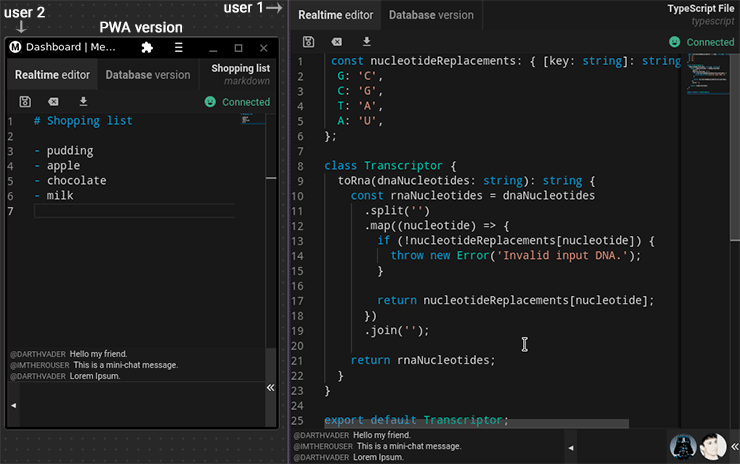

  

## Memoryboard

**<ins>Notes app</ins>, <ins>multi-user</ins>, <ins>realtime</ins>, with the <ins>VS-Code engine</ins>, for <ins>web</ins>, <ins>desktop</ins>, and <ins>mobile</ins>.**

I created this draft app a long time ago just to learn a little more about some technologies like: **Socket.io, Monaco, Redux, Prisma...**

[◄ Back link](https://github.com/ronoctua/old-study-codes#🖖)
