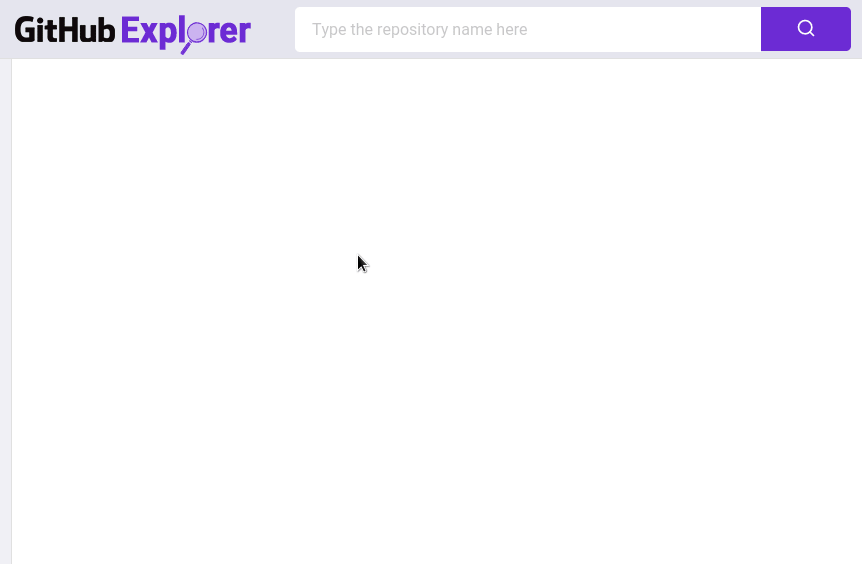

  

 

[◄ Back link](https://github.com/imtherouser/Studies/tree/master/study-codes/Rocketseat#🚀)

### 🐙 GitHub Explorer

It is an app to explore GitHub repositories.

 

### 🐙 My version following the original idea:

  

 

### 🐙 My own version of the app (file manager style):

  

[◄ Back link](https://github.com/imtherouser/Studies/tree/master/study-codes/Rocketseat#🚀)
