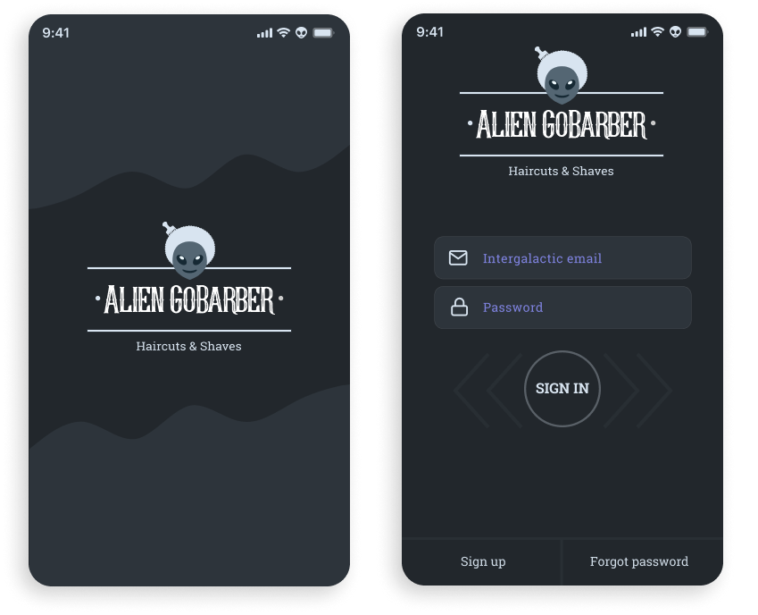
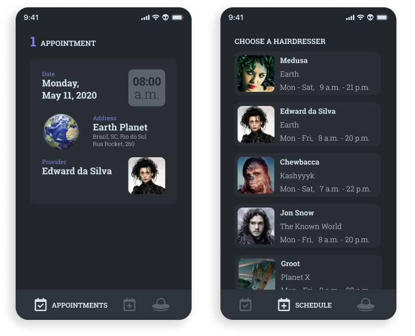

  

[◄ Back link](https://github.com/imtherouser/Studies/study-codes/Rocketseat#🚀)

### 🎓 GoBarber

It is a complete solution (api, web, mobile) created for a barber shop, using many technologies, and also applying programming concepts and architectural standards.

 

### 🎓 Some of the technologies used

<table>
<tbody>
  <tr>
    <td>Eslint</td>
    <td>NodeJS</td>
    <td>ReactJS</td>
    <td>React Native</td>
    <td>Express</td>
    <td>JsonWebToken</td>
  </tr>
  <tr>
    <td>Babel</td>
    <td>TypeScript</td>
    <td>Knex</td>
    <td>CORS</td>
    <td>Axios</td>
    <td>Docker</td>
  </tr>
  <tr>
    <td>Postgre</td>
    <td>MongoDB</td>
    <td>Redis</td>
    <td>TypeORM</td>
    <td>TSyringe</td>
    <td>BcryptJS</td>
  </tr>
  <tr>
    <td>Multer</td>
    <td>Nodemailer</td>
    <td>AWS SDK</td>
    <td>Styled Components</td>
    <td>Handlebars</td>
    <td>ioredis</td>
  </tr>
  <tr>
    <td>Celebrate</td>
    <td>Yup</td>
    <td>Unform</td>
    <td>Jest</td>
    <td>Prettier</td>
    <td>date-fns</td>
  </tr>
</tbody>
</table>

 

### 🎓 Figma links

> ↳ **[Original design on Figma](https://www.figma.com/file/BXCihtXXh9p37lGsENV614/GoBarber?node-id=34%3A1181)**

> ↳ **[My alien design on Figma](https://www.figma.com/file/reEYELjIUyYEsigChzLPJw/Alien-GoBarber?node-id=0%3A1)**

> ↳ **[My steampunk login design on Figma](https://www.figma.com/file/9pNIvGgEHsJMYWHZ5f4pv3/Steampunk-GoBarber?node-id=0%3A1)**

 

### 🎓 Original GoBarber

  

  

 

### 🎓 My steampunk login design on Figma

  

 

### 🎓 My alien Figma design

  

  

[◄ Back link](https://github.com/imtherouser/Studies/study-codes/Rocketseat#🚀)
