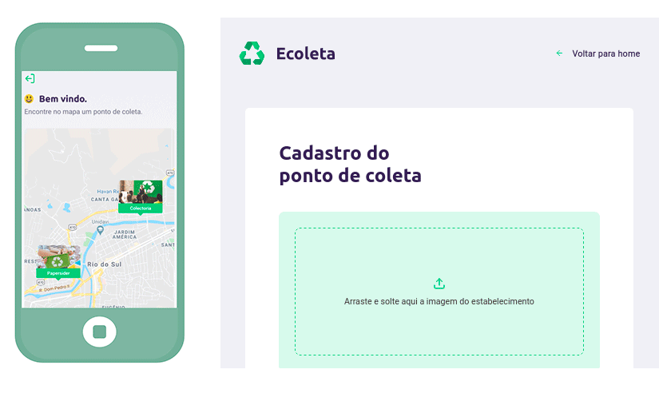

  

 

[◄ Back link](https://github.com/imtherouser/Studies/tree/master/study-codes/Rocketseat#🚀)

### 🟢 Ecoleta

Ecoleta is a solution to map and locate companies that collect waste in a sustainable way.

- **Event:** Next Level Week

- **Edition:** 01

- **Date:** 01.06.2020 - 07.06.2020

 

### 🟢 My version following the original idea:

  

 

### 🟢 My own implementation of a web user interface:

  

[◄ Back link](https://github.com/imtherouser/Studies/tree/master/study-codes/Rocketseat#🚀)
