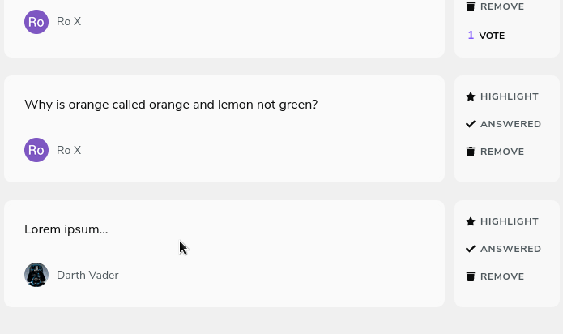

 

  

 

[◄ Back link](https://github.com/imtherouser/Studies/tree/master/study-codes/Rocketseat#🚀)

### 🟣 LetMeAsk

LetMeAsk is an app to post questions, in real-time, to be answered during a live stream.

- **Event:** Next Level Week

- **Edition:** 06

- **Date:** 20.06.2021 - 27.06.2021

- **Figma:** [Project Figma link](https://www.figma.com/file/kZga9S84GcBrFNYJ9rDNGV/Letmeask?node-id=0%3A1)

 

### 🟣 My version

I added new features, like: **👉** accessibility tools, **👉** new responsive layout, **👉** pwa, **👉** multiple themes, **👉** question filters, **👉** NextJS, **👉** Eslint, **👉** Styled Components...

  

 

 

  

 

[◄ Back link](https://github.com/imtherouser/Studies/tree/master/study-codes/Rocketseat#🚀)
