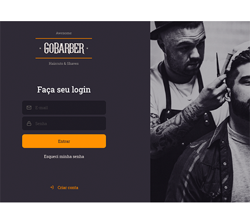
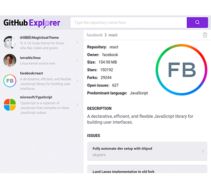
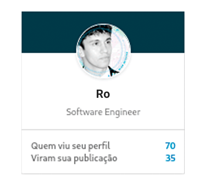
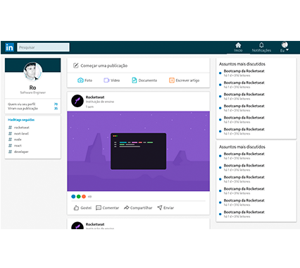
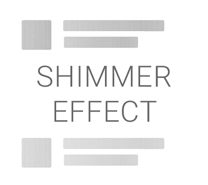
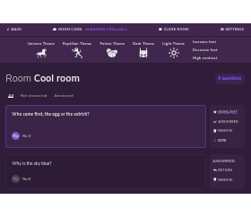
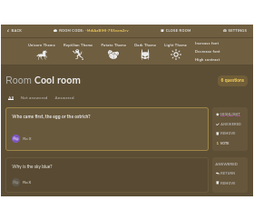
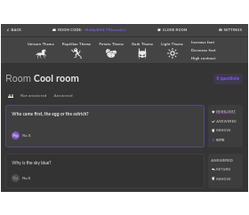
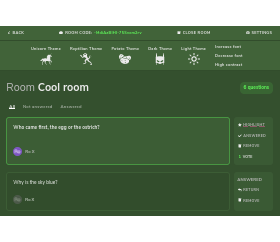
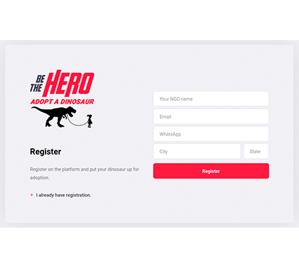

  

  
  

[◄ Back link](https://github.com/imtherouser/Studies#🖖)

 

> This repository contains codes developed by me through the content provided by the Rocketseat company.

 

> Click on the links below to open the apps readme, codes, and screenshots.

  

### 🟪 **BOOTCAMP CODES • GoStack 11**

> GoStack 11 was intensive training in technologies like NodeJS, ReactJS, React Native and many others.

 

**[GoBarber](bootcamp/GoStack11/GoBarber#🚀)** ┊ The most complete code I've created through Rocketseat content. It is a integral solution (api, web, mobile) created for a barbershop, using an abundance of technologies and programming principles. 🌟 Highlighted!

<table>
  <tr>
    <td>
      
    </td>
    <td>
      
    </td>
    <td>
      
    </td>
    <td>
      
    </td>
  </tr>
</table>

 

**[GitHub Explorer](bootcamp/GoStack11/GitHubExplorer#🚀)** ┊ An simple app to explore GitHub repositories. It was developed at the beginning of the bootcamp to introduce about api.

<table>
  <tr>
    <td>
      
    </td>
    <td>
      
    </td>
    <td>
      
    </td>
    <td>
      
    </td>
  </tr>
</table>

  

### 🟪 **YOUTUBE CODES**

> Content learned on the Rocketseat YouTube channel.

 

**[LinkedIn Clone](youtube/LinkedInClone#🚀)** ┊ It is a clone of the LinkedIn user interface in order to learn how to apply the "Shimmer Effect".

<table>
  <tr>
    <td>
      
    </td>
    <td>
      
    </td>
    <td>
      
    </td>
    <td>
      
    </td>
  </tr>
</table>

  

### 🟪 **EVENT CODES • Next Level Week**

> Next Level Week is a periodic event where an app is developed over the course of an entire week.

 

**[LetMeAsk](events/NextLevelWeek/NLW06-LetMeAsk#🚀)** _`NLW 06`_ ┊ LetMeAsk is an app to post questions, in real-time, to be answered during a live stream.

<table>
  <tr>
    <td>
      
    </td>
    <td>
      
    </td>
    <td>
      
    </td>
    <td>
      
    </td>
  </tr>
</table>

 

**[Ecoleta](events/NextLevelWeek/NLW01-Ecoleta#🚀)** _`NLW 01`_ ┊ Ecoleta is a solution (api, web and mobile) to map and locate companies that collect waste in a sustainable way.

<table>
  <tr>
    <td>
      
    </td>
    <td>
      
    </td>
    <td>
      
    </td>
    <td>
      
    </td>
  </tr>
</table>

  

### 🟪 **EVENT CODES • Semana OmniStack**

> Event that no longer exists in which complete solutions were developed - api, web and mobile.

 

**[Be The Hero](events/SemanaOmniStack/SO11-BeTheHero#🚀)** _`SO 11`_ ┊ Developed at the first Rocketseat event I attended. It is a solution to connect NGOs with people willing to help.

<table>
  <tr>
    <td>
      
    </td>
    <td>
      
    </td>
    <td>
      
    </td>
    <td>
      
    </td>
  </tr>
</table>

  

### 🟪 Useful Links

↳ [Rocketseat - Me on Rocketseat's social network](https://app.rocketseat.com.br/me/imtherouser#🚀)

↳ [Rocketseat - Main page](https://rocketseat.com.br/#🚀)

↳ [Rocketseat - YouTube](https://www.youtube.com/rocketseat#🚀)

↳ [Rocketseat - Twitch](https://www.twitch.tv/rocketseat_oficial#🚀)

↳ [Rocketseat - Twitter](https://twitter.com/rocketseat#🚀)

↳ [Rocketseat - GitHub](https://github.com/Rocketseat#🚀)

↳ [Rocketseat - Facebook](https://www.facebook.com/rocketseat#🚀)

 

[◄ Back link](https://github.com/imtherouser/Studies#🖖)
